# DevOps Project - Shopping website!
A Shopping Website with Microservices Architecture with backend on Java Spring Boot and Frontend in Angular. The objective of our project was to learn about microservices architecture and various design patterns such as circuit breaker, DTOs (Data Transfer Objects) etc. used in making one. How communication between microservices takes place and how to handle a situations when a service is down.

        

## Group 3 - Team Members
|S No	|Name                           |Roll No			|
|-------|-------------------------------|-------------------|
|1		|Nitin Kumar           			|2020HS70003			|
|2   	|||
|3     	|||
|4     	|||
|5     	|||

## Sequence Diagram

```mermaid
sequenceDiagram
Browser ->> Product: Requests for Catalog
Product ->> Browser: 200: Lists all the Products
Browser ->> Order: Orders some products
Order ->> Product: Validates Ordered Items
Product ->> Order: 204: Items exists and in stock
Order->>Payment: Process and store
#Product-x Order: Out of Stocaak!
Payment->>Browser: Order Placed Successfully !
Product --x Browser: 503: Product Service Unavailable 
Product-x Order: 400: Invalid or Out of Stock!
Order-x Browser: 400: Out of Stock!
Order--x Product: 503: Order Service Unavailable

#Order--x Payment: 
Payment--x Order: 503: Payment Service Unavailable
Note right of Payment: Timeout set for 10<br/>seconds, if no res-<br/>ponse is recived th-<br/>en Error 503 is sent.

#Order-->Product: Checking with John...
Note  over  Product,Payment: Registered with Eureka Discovery Client and Cloud Gateway

#Product->Payment: Registered with Eureka Discovery Client and Cloud Gateway
```

## Jenkins Pipeline

